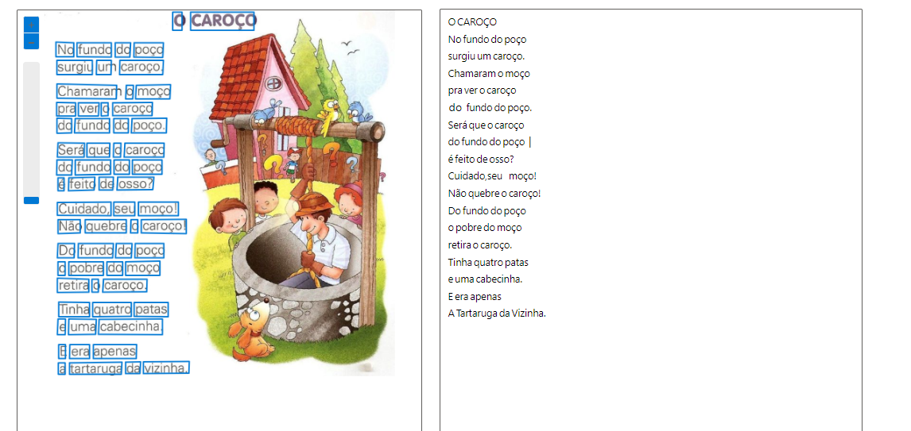
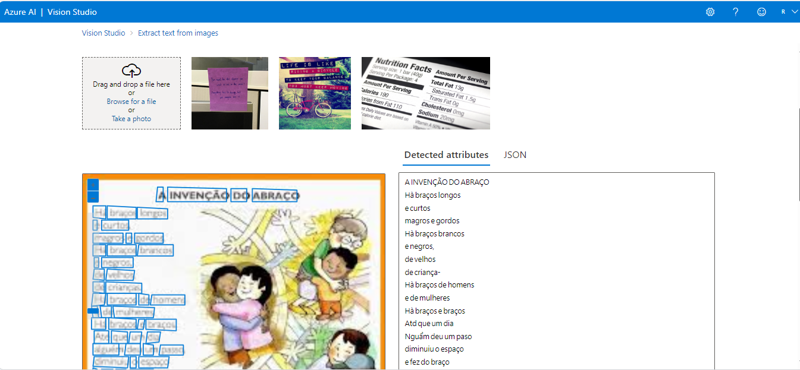

# Identificando textos e pessoas em imagens com Inteligência Artificial 
Neste segundo laboratiorio, vamos utilizar a plataforma do <a href="https://portal.azure.com/?azure-portal=true" target="__blank">Microsoft Azure</a>, para criar recursos que são capazes de identificar texto/pessoas em imagens.

### Ferramentas

### Textos em imagens 

1 -  Ao entrar no <a href="https://portal.azure.com/?azure-portal=true" target="__blank">portal do azure</a>, no menu lateral esquerdo procure a opção de criar um recurso, e logo em seguida selecione o create da opção Azure Al Services.   
2 -  Assim como no laboratorio anterior vamos seguir a documentação oficial e preencher os seguintes campos
<ul>
    <li><b>Resource Group:</b> imagens </li>
    <li><b>Region:</b> East US </li>
    <li><b>Name:</b> labimagens </li>
    <li><b>Princing Tier:</b> Standard SO</li>
</ul> 
<b>Obs:</b> 
<ul>
    <li>- Os campos de <b>Name</b> e <b>Resource Group</b> você pode atribuir os nome da sua preferência</li>
    <li>- Selecione o <b>check box!!</b></li>
</ul>
3 - Após todos os preenchimentos, clique em <b>Review + Create</b> e logo após em <b>Create</b>
4 - Abra o <a href="https://portal.vision.cognitive.azure.com/?azure-portal=true">Azure Vision</a>
5 - clique em todos os recursos, selecione o recurso que acabamos de criar e clique em Select as default resource. Não vai ter nenhum ação e você pode fechar no X superior direito.
<b>Obs:</b> O X mencionado no passo anterior <b>não</b> é o que fecha a aba do navegador

6 - Selecione Reconhecimento óptico de caracteres e logo em seguida extrair texto de imagens.

7 - Selecione o checkbox e clique em procurar um arquivo, logo em seguida, selecione sua imagem.

8 - Após todos seguir todos os passos esse será o resultado final: 
Imagem 1

Imagem 2

